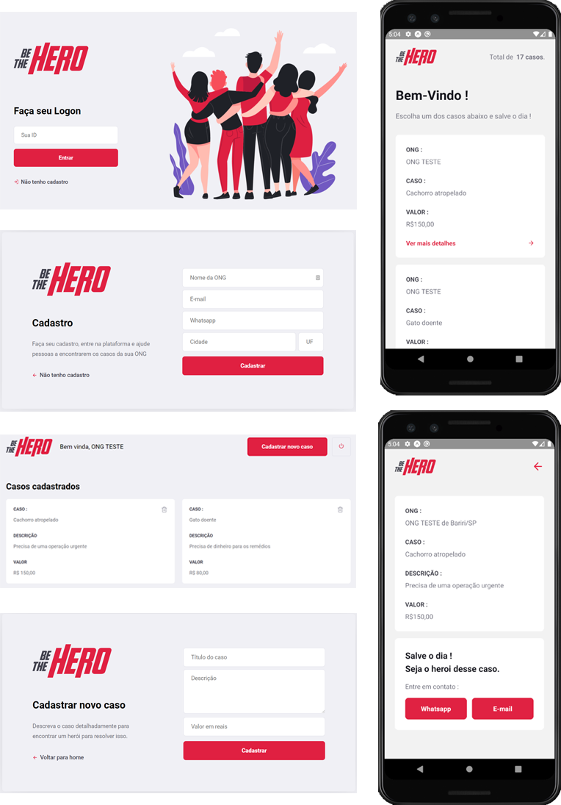

# SEMANA OMNISTACK 11  (BE THE HERO)
Be the hero is a full project developed using JS stack (**nodeJS**, **React** and **React Native**) that connect non-profit organizations with donors and volunteers.

Non-profit organizations can register themselves on the web application and add specific tasks or problems that required help to be resolved

And donors and volunteers can access the mobile application to find a list with all the tasks available and choose one of these problems and contact the organization to help.    

## noteworthy stuff that I learned
### backend
 - Create a Controller for each route path
 - Use different HTTP requisitions to identify a route purpose
 - How to use `async` functions with `await` 
 -  Run SQL queries using js language with [knex](http://knexjs.org/)
	`connection('incidents').where('ong_id', ong_id).select('*')`	 
- Directly get variables from js objects using `{}` and `[]`
- Install development only packages (`devDependencies`), with `-D` flag on `npm install -D packagename`
- Use `crypto` to generate a random unique string value
- Use migrations from [knex](http://knexjs.org/) to store and maintain the database structure
 - Create useful `package.json` commands with `scripts` attribute
 - Use HTTP `header` properties to authenticate users 
 - Make validations in routes using [celebrate](https://www.npmjs.com/package/celebrate)
 - Restructure the project to receive automated tests
 - Implement `Unit` and `Integration` tests
 
### frontend
- **React** technology and Concepts at all
- Organize a **React** Project folder structure 
- Create and utilize my own React Components
- Use `BrowserRouter`, `Switch` and `Route` components to organize the routing process on React
- Run HTTP requisition with `axios`
- Use `Link` and `useHistory` components to navigate and redirect pages inside React architecture taking advantage of single page concept
- `map` and `filter` js ES6 functions
- Use for the first time `Intl` to internationalize currency 
- Store and retrieve session variables with `localStorage`  
- Set and Get variables inside React with `useState`

### mobile
- **React Native** technology and concepts at all
- Use expo to speed up the development process 
- Use `NavigationContainer` and `AppStack` to navigate between screens in app
-  How to structure and stylize in **React Native**
- Differences between **React Native** and **ReactiveJS**
- Display a list of items with dynamic items loading based on the list scrolled percentage

### overall
- Cool **Visual Code** shortcuts
- Even cooler **Visual Code** Extensions
- Taking advantage of **Visual Code** single and split terminals
- Use [Insomnia](https://insomnia.rest/) to quickly test node API touch points  
- Install and use a Android Simulator to debug the application
- Use `[...arrayA, ...arrayB]` notation to append array elements
